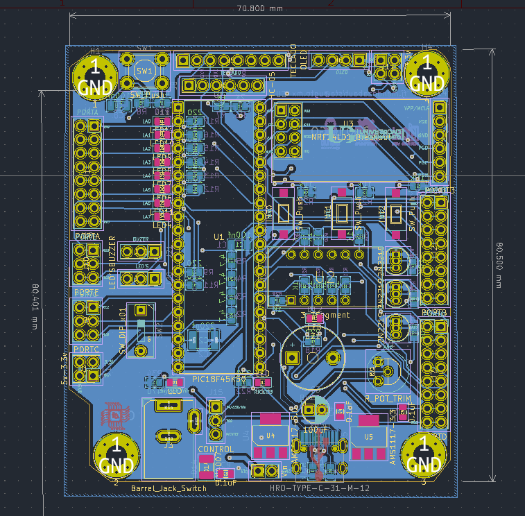
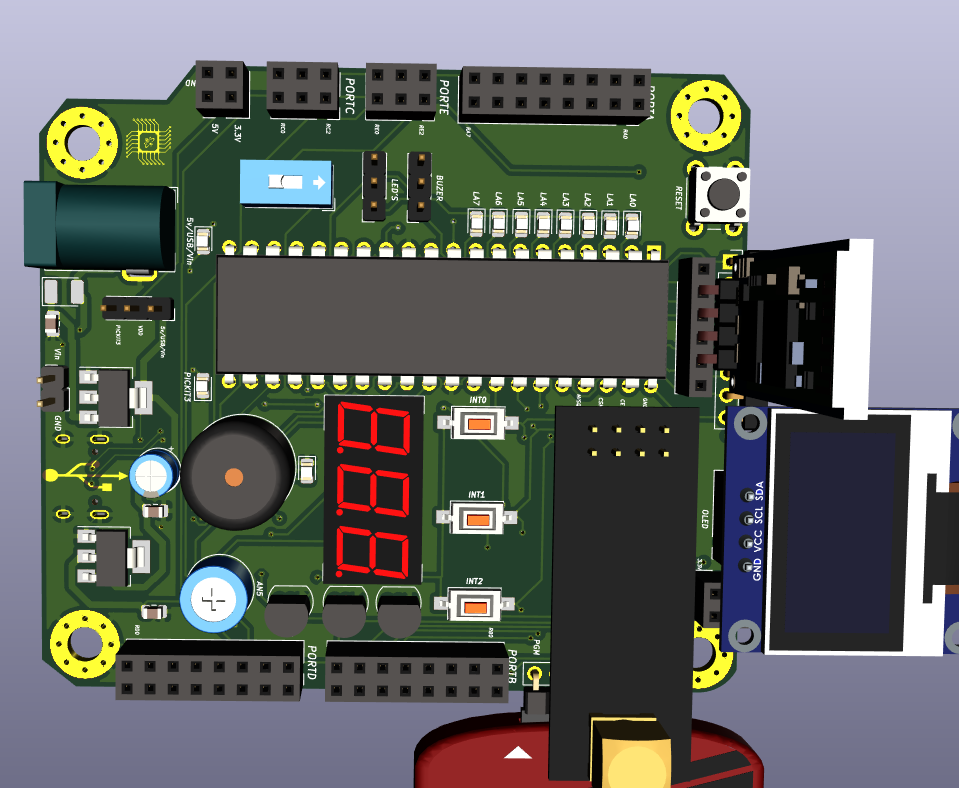

# JAPIC placa de desarrollo

  

## ¿Cómo nació el proyecto **_JAPIC_**?

Cuando era estudiante cursé la materia de programación de microcontroladores utilizando como herramienta el **PIC18F45K50**. El diseño de **PCB** se convirtió en una de mis más grandes pasiones, así que decidí diseñar una placa con ese microcontrolador, agregando los módulos necesarios para dar origen a la primera versión de **_JAPIC_**.

## ¿Qué se espera del proyecto **_JAPIC_**?

Se espera que este diseño pueda ser de gran utilidad para las nuevas generaciones que se van adentrando al mundo de la programación de microcontroladores y también al diseño de **PCB**.

## Estructura de **_JAPIC_**

- [Schematic](#item1)
- [PCB](#item2)
  - [**F.Cu**](#item9)
  - [**B.Cu**](#item7)
  - [**Vista 3D**](#item8)
- [Final](#item9)

### Schequetic:

[Subir](#top)

### PCB

**B.Cu:**

**F.Cu:**

[Subir](#top)

**_Vista 3D:_**

[Subir](#top)

**_Final:_**

[Subir](#top)

Seguir leyendo en [javimenba](https://github.com/javimenba/javimenba)
