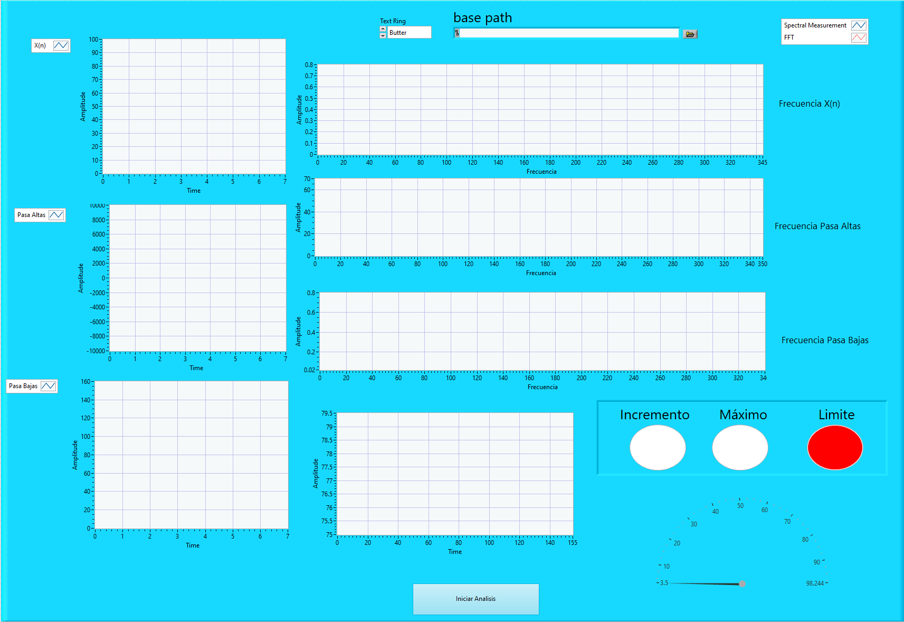
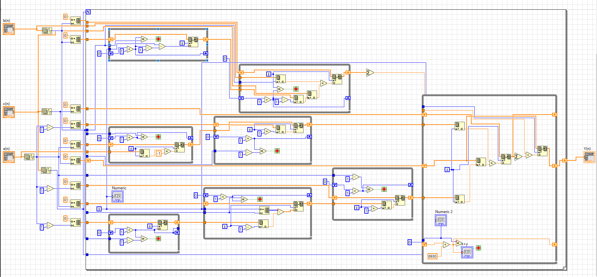

<h1>Labview</h1>
Se presenta una interfaz que nos permita visualizar una señal de un sensor de tipo Goniometer(GON) que se obtuvo gracias a
[biosignalsplux](biosignalsplux.com)

<h2> Panel de bloques </h2>

