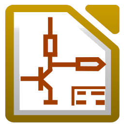

<h1> Hi I'm Javier  </h1>

  

  

<h3> Currently working on </h3>

<h3> Other Languages I know </h3>

<h3> Operating systems I know </h3>

 

<h2> Design Circuit </h2>

**Design of a development board for the PIC18F45K50 microcontroller.** [JAPIC](https://github.com/javimenba/javimenba/blob/main/.JAPIC/JAPIC.md)

<h2>Code developed in block diagram</h2>

---
